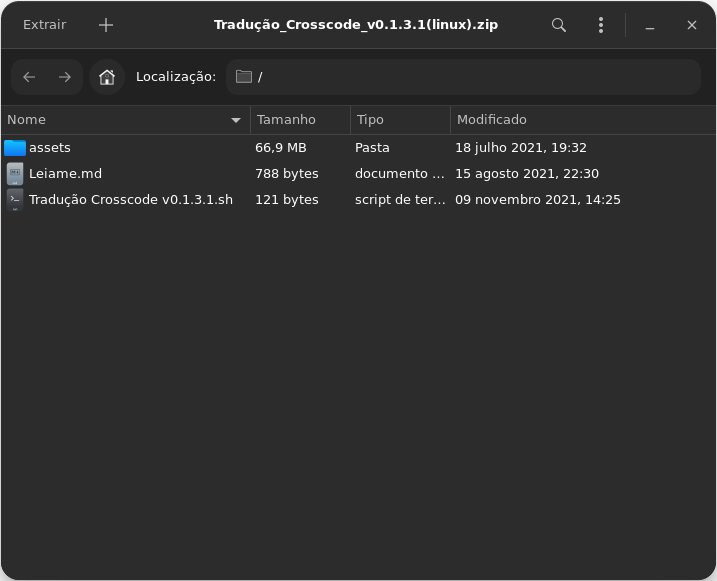
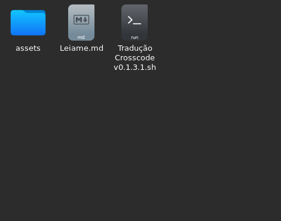
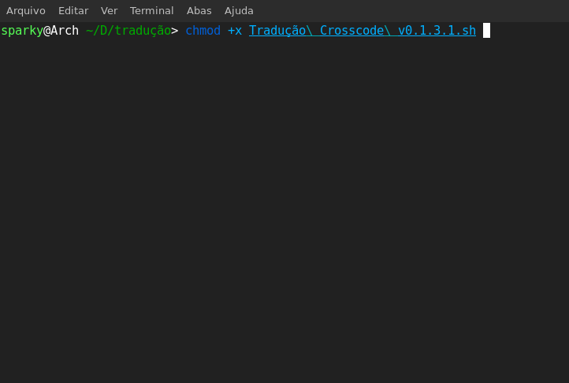
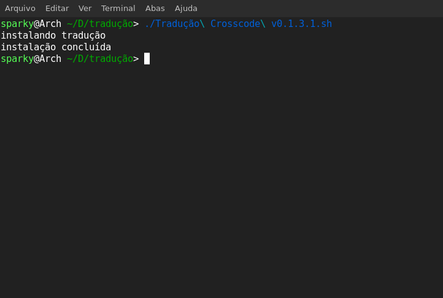

# Crosscode PT-BR

 
# Sobre 

Esse repositório contém arquivos de um projeto que visa **traduzir o game Crosscode**. A tradução ainda não está 100% completa, e encontra-se em andamento.Você pode testar as traduções aqui:

  

## Instalação

### Versão de Windows

Baixe o instalador e aponte para a pasta do jogo. Após isso, clique em instalar.

### Versão de Linux

Baixe o .zip para Linux

 

extraia os arquivos 

Conceda permissões de execução para o arquivo .sh

Execute o arquivo .sh 

## Versão de Mac

Baixe e extraia os arquivos para a pasta do jogo.

## Atualização

Se você deseja obter as traduções atualizadas, é possível obter as versões estáveis e testadas [aqui](https://github.com/Bugaboo2000/Crosscode-Traducao/releases). Se deseja obter as atualizações mais recentes, você pode clonar o repositório ou baixar o código fonte. Feito isso, mova os arquivos para a pasta do game. Esse procedimento **fica por sua conta e risco**.

## Reportando Erros

Ao reportar você está contribuindo para melhorar a tradução. Caso se depare com uma tradução que se encontra estranha ou fora de contexto, preferência reportar no nosso **canal do Discord**, enviando uma print. Você pode reportar na aba [Issues](https://github.com/Bugaboo2000/Crosscode-Traducao/issues) do Github se quiser.

## Contribuindo 

Você pode **contribuir fazendo um Fork**, e mandar um **pull request**. Note que sua contribuição **poderá demorar** devido a moderação.

Recomendamos também que entre no nosso **grupo do Discord** para mais informações.

## Créditos

* [Sextare](https://www.youtube.com/watch?v=kyqA59m2WDI) - pelos arquivos, e por o ser o primeiro a tomar iniciativa da tradução

* [Bugaboo2000](https://github.com/Bugaboo2000) - Criação do repositório, banner e tradução

* [M4sterin](https://github.com/m4sterin) - Revisão, tradução e manutenção do código

* [KingTimer12](https://github.com/KingTimer12) - Ajudar na tradução 

* [spacetk00](https://github.com/spacetk00) - Ajudar na Tradução e complementar a mesma

